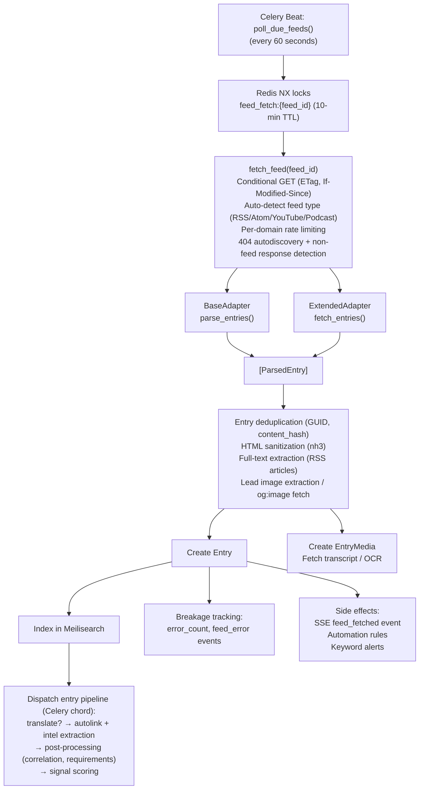

# Feed Ingestion Pipeline

```mermaid
flowchart TD
    beat["Celery Beat: poll_due_feeds()<br/>(every 60 seconds)"] --> lock["Redis NX locks<br/>feed_fetch:{feed_id} (10-min TTL)"]
    lock --> fetch["fetch_feed(feed_id)<br/>Conditional GET (ETag, If-Modified-Since)<br/>Auto-detect feed type (RSS/Atom/YouTube/Podcast)<br/>Per-domain rate limiting<br/>404 autodiscovery + non-feed response detection"]
    fetch --> base["BaseAdapter<br/>parse_entries()"]
    fetch --> ext["ExtendedAdapter<br/>fetch_entries()"]
    base --> parsed["[ParsedEntry]"]
    ext --> parsed
    parsed --> dedup["Entry deduplication (GUID, content_hash)<br/>HTML sanitization (nh3)<br/>Full-text extraction (RSS articles)<br/>Lead image extraction / og:image fetch"]
    dedup --> entry["Create Entry"]
    dedup --> media["Create EntryMedia<br/>Fetch transcript / OCR"]
    entry --> meili["Index in Meilisearch"]
    entry --> errev["Breakage tracking:<br/>error_count, feed_error events"]
    meili --> pipeline["Dispatch entry pipeline (Celery chord):<br/>translate? → autolink + intel extraction<br/>→ post-processing (correlation, requirements)<br/>→ signal scoring"]
    entry --> side["Side effects:<br/>SSE feed_fetched event<br/>Automation rules<br/>Keyword alerts"]
```
