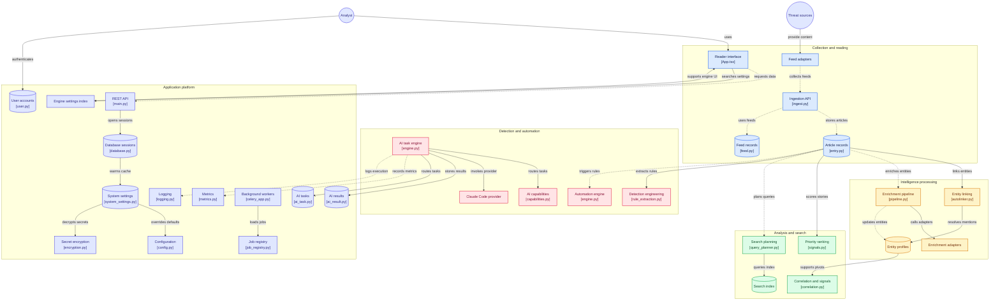

# Application Overview

```mermaid
flowchart TD

subgraph group_collection["Collection and reading"]
  node_reader["Reader interface<br/>[App.tsx]"]
  node_feed_adapters["Feed adapters"]
  node_ingest["Ingestion API<br/>[ingest.py]"]
  node_entry[("Article records<br/>[entry.py]")]
  node_feed[("Feed records<br/>[feed.py]")]
end

subgraph group_intel["Intelligence processing"]
  node_autolink["Entity linking<br/>[autolinker.py]"]
  node_enrichment["Enrichment pipeline<br/>[pipeline.py]"]
  node_enrichment_sources["Enrichment adapters"]
  node_entities[("Entity profiles")]
end

subgraph group_analysis["Analysis and search"]
  node_correlation["Correlation and signals<br/>[correlation.py]"]
  node_priority["Priority ranking<br/>[signals.py]"]
  node_search["Search planning<br/>[query_planner.py]"]
  node_meilisearch[("Search index")]
end

subgraph group_detection["Detection and automation"]
  node_detection["Detection engineering<br/>[rule_extraction.py]"]
  node_automation["Automation engine<br/>[engine.py]"]
  node_ai_engine["AI task engine<br/>[engine.py]"]
  node_ai_capabilities["AI capabilities<br/>[capabilities.py]"]
  node_claude_provider["Claude Code provider"]
end

subgraph group_platform["Application platform"]
  node_api["REST API<br/>[main.py]"]
  node_database[("Database sessions<br/>[database.py]")]
  node_settings[("System settings<br/>[system_settings.py]")]
  node_config["Configuration<br/>[config.py]"]
  node_encryption["Secret encryption<br/>[encryption.py]"]
  node_metrics["Metrics<br/>[metrics.py]"]
  node_logging["Logging<br/>[logging.py]"]
  node_celery["Background workers<br/>[celery_app.py]"]
  node_job_registry["Job registry<br/>[job_registry.py]"]
  node_ai_result[("AI results<br/>[ai_result.py]")]
  node_ai_task[("AI tasks<br/>[ai_task.py]")]
  node_user[("User accounts<br/>[user.py]")]
  node_engine_settings["Engine settings index"]
end

node_analyst(("Analyst"))
node_sources(("Threat sources"))

node_analyst -->|"uses"| node_reader
node_reader -.->|"requests data"| node_api
node_sources -->|"provide content"| node_feed_adapters
node_feed_adapters -.->|"collects feeds"| node_ingest
node_ingest -.->|"stores articles"| node_entry
node_ingest -.->|"uses feeds"| node_feed
node_entry -->|"links entities"| node_autolink
node_entry -.->|"enriches entities"| node_enrichment
node_enrichment -->|"calls adapters"| node_enrichment_sources
node_autolink -->|"resolves mentions"| node_entities
node_enrichment -.->|"updates entities"| node_entities
node_entities -->|"supports pivots"| node_correlation
node_entry -->|"scores stories"| node_priority
node_entry -.->|"plans queries"| node_search
node_search -->|"queries index"| node_meilisearch
node_entry -->|"extracts rules"| node_detection
node_entry -.->|"triggers rules"| node_automation
node_ai_engine -->|"routes tasks"| node_ai_capabilities
node_ai_engine -->|"invokes provider"| node_claude_provider
node_ai_engine -->|"stores results"| node_ai_result
node_ai_engine -->|"routes tasks"| node_ai_task
node_api -->|"opens sessions"| node_database
node_database -->|"warms cache"| node_settings
node_settings -->|"overrides defaults"| node_config
node_settings -->|"decrypts secrets"| node_encryption
node_celery -->|"loads jobs"| node_job_registry
node_ai_engine -.->|"records metrics"| node_metrics
node_ai_engine -.->|"logs execution"| node_logging
node_analyst -->|"authenticates"| node_user
node_reader -->|"searches settings"| node_engine_settings
node_engine_settings -->|"supports engine UI"| node_reader

click node_reader "https://github.com/a-oneil/intelfeed/blob/main/frontend/src/App.tsx"
click node_feed_adapters "https://github.com/a-oneil/intelfeed/tree/main/backend/app/adapters"
click node_ingest "https://github.com/a-oneil/intelfeed/blob/main/backend/app/api/ingest.py"
click node_entry "https://github.com/a-oneil/intelfeed/blob/main/backend/app/models/entry.py"
click node_feed "https://github.com/a-oneil/intelfeed/blob/main/backend/app/models/feed.py"
click node_autolink "https://github.com/a-oneil/intelfeed/blob/main/backend/app/intelligence/autolinker.py"
click node_enrichment "https://github.com/a-oneil/intelfeed/blob/main/backend/app/enrichment/pipeline.py"
click node_enrichment_sources "https://github.com/a-oneil/intelfeed/tree/main/backend/app/enrichment/adapters"
click node_entities "https://github.com/a-oneil/intelfeed/tree/main/backend/app/models"
click node_correlation "https://github.com/a-oneil/intelfeed/blob/main/backend/app/intelligence/correlation.py"
click node_priority "https://github.com/a-oneil/intelfeed/blob/main/backend/app/intelligence/signals.py"
click node_search "https://github.com/a-oneil/intelfeed/blob/main/backend/app/search/query_planner.py"
click node_meilisearch "https://github.com/a-oneil/intelfeed/blob/main/backend/app/services/meilisearch_client.py"
click node_detection "https://github.com/a-oneil/intelfeed/blob/main/backend/app/intelligence/rule_extraction.py"
click node_automation "https://github.com/a-oneil/intelfeed/blob/main/backend/app/automation/engine.py"
click node_ai_engine "https://github.com/a-oneil/intelfeed/blob/main/backend/app/ai/engine.py"
click node_ai_capabilities "https://github.com/a-oneil/intelfeed/blob/main/backend/app/ai/capabilities.py"
click node_claude_provider "https://github.com/a-oneil/intelfeed/blob/main/backend/app/ai/providers/claude_code_provider.py"
click node_api "https://github.com/a-oneil/intelfeed/blob/main/backend/app/main.py"
click node_database "https://github.com/a-oneil/intelfeed/blob/main/backend/app/database.py"
click node_settings "https://github.com/a-oneil/intelfeed/blob/main/backend/app/services/system_settings.py"
click node_config "https://github.com/a-oneil/intelfeed/blob/main/backend/app/config.py"
click node_encryption "https://github.com/a-oneil/intelfeed/blob/main/backend/app/core/encryption.py"
click node_metrics "https://github.com/a-oneil/intelfeed/blob/main/backend/app/core/metrics.py"
click node_logging "https://github.com/a-oneil/intelfeed/blob/main/backend/app/core/logging.py"
click node_celery "https://github.com/a-oneil/intelfeed/blob/main/backend/app/workers/celery_app.py"
click node_job_registry "https://github.com/a-oneil/intelfeed/blob/main/backend/app/workers/job_registry.py"
click node_ai_result "https://github.com/a-oneil/intelfeed/blob/main/backend/app/models/ai_result.py"
click node_ai_task "https://github.com/a-oneil/intelfeed/blob/main/backend/app/models/ai_task.py"
click node_user "https://github.com/a-oneil/intelfeed/blob/main/backend/app/models/user.py"
click node_engine_settings "https://github.com/a-oneil/intelfeed/blob/main/frontend/src/components/engine/engineSettingsIndex.ts"

classDef toneNeutral fill:#f8fafc,stroke:#334155,stroke-width:1.5px,color:#0f172a
classDef toneBlue fill:#dbeafe,stroke:#2563eb,stroke-width:1.5px,color:#172554
classDef toneAmber fill:#fef3c7,stroke:#d97706,stroke-width:1.5px,color:#78350f
classDef toneMint fill:#dcfce7,stroke:#16a34a,stroke-width:1.5px,color:#14532d
classDef toneRose fill:#ffe4e6,stroke:#e11d48,stroke-width:1.5px,color:#881337
classDef toneIndigo fill:#e0e7ff,stroke:#4f46e5,stroke-width:1.5px,color:#312e81
classDef toneTeal fill:#ccfbf1,stroke:#0f766e,stroke-width:1.5px,color:#134e4a
class node_reader,node_feed_adapters,node_ingest,node_entry,node_feed toneBlue
class node_autolink,node_enrichment,node_enrichment_sources,node_entities toneAmber
class node_correlation,node_priority,node_search,node_meilisearch toneMint
class node_detection,node_automation,node_ai_engine,node_ai_capabilities,node_claude_provider toneRose
class node_api,node_database,node_settings,node_config,node_encryption,node_metrics,node_logging,node_celery,node_job_registry,node_ai_result,node_ai_task,node_user,node_engine_settings,node_analyst,node_sources toneIndigo
```