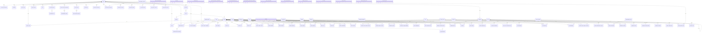

# Database ER Diagram

```mermaid
erDiagram
    USER ||--o{ ENTRY_STATE : creates
    USER ||--o{ PLAYBACK_PROGRESS : creates
    USER ||--o{ COMMENT : authors
    USER ||--o{ ENTITY_NOTE : creates
    USER ||--o{ CATEGORY : creates
    USER ||--o{ NOTE : creates
    USER ||--o{ SAVED_SEARCH : creates
    USER ||--o{ TAG : creates
    USER ||--o{ DETECTION_RULE : creates
    USER ||--o{ AUTOMATION_RULE : creates
    USER ||--o{ INTELLIGENCE_REQUIREMENT : creates
    USER ||--o{ INTEL_REPORT : creates
    USER ||--o{ CAMPAIGN : creates
    USER ||--o{ DASHBOARD : creates
    USER ||--o{ DETECTION_SUMMARY : creates
    USER ||--o{ AI_TASK_ASSIGNMENT : creates
    USER ||--o{ ENRICHMENT_OVERRIDE : creates
    USER ||--o{ TELEMETRY_SOURCE : creates
    USER ||--o{ WEBHOOK_PRESET : creates
    USER ||--o{ AI_CONVERSATION : owns
    USER ||--o{ USER_ENTITY_WATCH : creates
    USER ||--o{ ENTRY_SIGNAL_FEEDBACK : creates

    FEED ||--o{ ENTRY : hosts
    FEED ||--o{ PODCAST : has
    CATEGORY ||--o{ FEED : groups

    ENTRY ||--o{ ENTRY_STATE : tracks
    ENTRY ||--o{ ENTRY_MEDIA : contains
    ENTRY ||--o{ NOTE : annotates
    ENTRY ||--o{ ENTRY_TAG : tags
    ENTRY ||--o{ ENTRY_TTP : mentions
    ENTRY ||--o{ ENTRY_CVE : mentions
    ENTRY ||--o{ ENTRY_THREAT_ACTOR : mentions
    ENTRY ||--o{ ENTRY_MALWARE : mentions
    ENTRY ||--o{ ENTRY_COUNTRY : mentions
    ENTRY ||--o{ ENTRY_MITIGATION : mentions
    ENTRY ||--o{ ENTRY_VENDOR : mentions
    ENTRY ||--o{ ENTRY_PRODUCT : mentions
    ENTRY ||--o{ ENTRY_TOOL : mentions
    ENTRY ||--o{ ENTRY_CWE : mentions
    ENTRY ||--o{ ENTRY_OBSERVABLE : mentions
    ENTRY ||--o{ ENTRY_SECTOR : targets
    SECTOR ||--o{ ENTRY_SECTOR : targeted_in
    THREAT_ACTOR ||--o{ THREAT_ACTOR_TARGET_SECTOR : targets
    SECTOR ||--o{ THREAT_ACTOR_TARGET_SECTOR : targeted_by
    MALWARE_FAMILY ||--o{ MALWARE_TARGET_SECTOR : targets
    SECTOR ||--o{ MALWARE_TARGET_SECTOR : targeted_by
    CAMPAIGN ||--o{ CAMPAIGN_SECTOR : scopes
    SECTOR ||--o{ CAMPAIGN_SECTOR : targeted_by
    ENTRY ||--o{ NARRATIVE_THEME_MEMBER : grouped_by
    ENTRY ||--o| ENTRY_EMBEDDING : embeds
    ENTRY ||--o| STORY_THREAD_ENTRY : threads
    ENTRY ||--o{ PENDING_AUTOLINK_MATCH : holds
    ENTRY ||--o{ DETECTION_RULE : sources
    ENTRY ||--o{ CAMPAIGN_ENTRY : campaigns
    ENTRY ||--o{ AI_RESULT : analyzes
    ENTRY ||--o{ ENTRY_SIGNAL : scores
    ENTRY ||--o{ ENTRY_SIGNAL_FEEDBACK : rates
    ENTRY ||--o{ ENTRY_PIPELINE_RUN : stages
    ENTRY ||--o| AI_ANALYSIS_REQUEST : queues
    ENTRY ||--o{ ENTITY_LINK_VALIDATION_LOG : audits

    TTP ||--o{ ENTRY_TTP : tagged
    TTP ||--o{ TTP_MITIGATION : mitigates

    CVE ||--o{ ENTRY_CVE : tagged
    CVE ||--o{ CVE_AFFECTED : affects
    CVE ||--o{ CVE_WEAKNESS : weakens
    CWE ||--o{ CVE_WEAKNESS : classifies
    CWE ||--o{ ENTRY_CWE : tagged
    CWE |o--o{ CWE : parent_of
    OBSERVABLE ||--o{ ENTRY_OBSERVABLE : sighted_in
    VENDOR |o--o{ CVE_AFFECTED : resolves
    PRODUCT |o--o{ CVE_AFFECTED : resolves
    VENDOR ||--o{ ENTRY_VENDOR : tagged
    PRODUCT ||--o{ ENTRY_PRODUCT : tagged

    THREAT_ACTOR ||--o{ ENTRY_THREAT_ACTOR : tagged
    THREAT_ACTOR ||--o{ THREAT_ACTOR_TARGET_COUNTRY : targets
    THREAT_ACTOR ||--o{ ACTOR_DESCRIPTION_HISTORY : versions
    THREAT_ACTOR |o--o{ VICTIM_DISCLOSURE : posts

    MALWARE_FAMILY ||--o{ ENTRY_MALWARE : tagged

    TOOL ||--o{ ENTRY_TOOL : tagged

    RANSOMWARE_VICTIM ||--o{ VICTIM_DISCLOSURE : disclosed_in

    COUNTRY ||--o{ ENTRY_COUNTRY : mentioned
    COUNTRY ||--o{ THREAT_ACTOR_TARGET_COUNTRY : targeted
    COUNTRY ||--o{ CAMPAIGN_COUNTRY : linked

    CAMPAIGN ||--o{ CAMPAIGN_ENTRY : contains
    CAMPAIGN ||--o{ CAMPAIGN_ENTITY : entities
    CAMPAIGN ||--o{ CAMPAIGN_SAVED_SEARCH : saved_searches
    CAMPAIGN ||--o{ CAMPAIGN_COUNTRY : countries
    CAMPAIGN ||--o{ CAMPAIGN_SOURCE : feeds_on

    STORY_THREAD ||--o{ STORY_THREAD_ENTRY : contains
    STORY_THREAD ||--o{ STORY_THREAD_BEAT : narrates
    STORY_THREAD ||--o{ USER_THREAD_STATE : read_by
    USER ||--o{ USER_THREAD_STATE : tracks

    NARRATIVE_BRIEFING ||--o{ NARRATIVE_THEME_MEMBER : groups

    DETECTION_RULE ||--o{ DETECTION_RULE_VERSION : versions
    DETECTION_RULE ||--o{ RULE_COVERAGE : covers

    AUTOMATION_RULE ||--o{ AUTOMATION_LOG : logs


    INTELLIGENCE_REQUIREMENT ||--o{ REQUIREMENT_MATCH : matches

    INTEL_REPORT ||--o{ INTEL_REPORT_VERSION : versions

    ENRICHMENT_SOURCE ||--o{ ENRICHMENT_OVERRIDE : overrides
    ENRICHMENT_SOURCE ||--o{ ENRICHMENT_RESULT : results

    AI_PROVIDER ||--o{ AI_TASK_ASSIGNMENT : assignments
    AI_PROVIDER ||--o{ AI_BATCH_JOB : batches

    AI_TASK ||--o{ AI_TASK_ASSIGNMENT : assignments
    AI_TASK ||--o{ AI_RESULT : results

    ENTITY_RELATIONSHIP {
        string note "polymorphic typed edges between intel entities"
    }
    JOB_RUN {
        string note "records scheduled job executions"
    }
    PIPELINE_PLAN {
        string note "composes pipeline stages per feed-category-global"
    }
    ENTITY_RECLASSIFY_TOMBSTONE {
        string note "suppresses cross-type entity resurrection"
    }
    ENTITY_MAINTENANCE_LOG {
        string note "audits AI entity maintenance"
    }
    ENTITY_MERGE_SUGGESTION_DISMISSAL {
        string note "remembers dismissed merge pairs"
    }
    ENTITY_ALIAS_INDEX {
        string note "trigger-maintained normalized name-alias index"
    }
    ENTITY_NAME_DENYLIST {
        string note "names banned from entity creation"
    }
    KNOWN_ALIAS_MAP {
        string note "MISP-MITRE reference alias clusters"
    }
    TTS_AUDIO {
        string note "cached Piper read-aloud audio bookkeeping"
    }
    INTEL_PROFILE {
        string note "named report scope: regions x sectors x window"
    }
    SECTOR {
        string note "closed victim-industry vocabulary: 21 seeded rows, never autolinked"
    }
    THREAT_BOARD_STATE {
        string note "per-threat triage decision on the Threats board"
    }
    LOG_TYPE_ALIAS {
        string note "folds log-source spellings onto one canonical name"
    }
```
