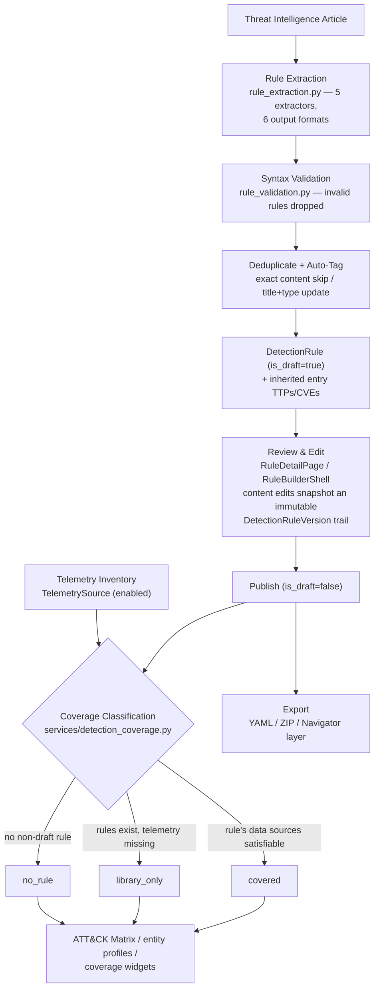

# Detection rule pipeline: extraction → validation → coverage

```mermaid
flowchart TD
    A[Threat Intelligence Article] --> B["Rule Extraction<br/>rule_extraction.py — 5 extractors,<br/>6 output formats"]
    B --> C["Syntax Validation<br/>rule_validation.py — invalid rules dropped"]
    C --> D["Deduplicate + Auto-Tag<br/>exact content skip / title+type update"]
    D --> E["DetectionRule (is_draft=true)<br/>+ inherited entry TTPs/CVEs"]
    E --> F["Review & Edit<br/>RuleDetailPage / RuleBuilderShell<br/>content edits snapshot an immutable<br/>DetectionRuleVersion trail"]
    F --> G["Publish (is_draft=false)"]
    G --> H{"Coverage Classification<br/>services/detection_coverage.py"}
    T["Telemetry Inventory<br/>TelemetrySource (enabled)"] --> H
    H -->|"rule's data sources satisfiable"| I[covered]
    H -->|"rules exist, telemetry missing"| J[library_only]
    H -->|"no non-draft rule"| K[no_rule]
    I --> L["ATT&CK Matrix / entity profiles /<br/>coverage widgets"]
    J --> L
    K --> L
    G --> M["Export<br/>YAML / ZIP / Navigator layer"]
```
