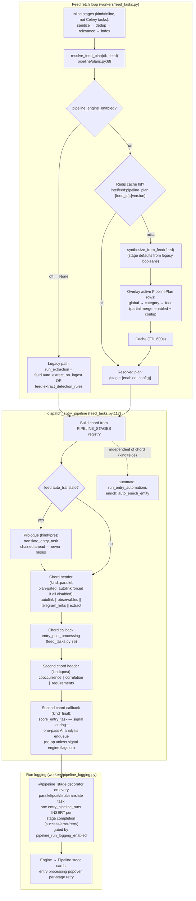

# Pipeline stage execution — plan resolution → Celery chord dispatch → run logging

```mermaid
flowchart TD
    subgraph FETCH["Feed fetch loop (workers/feed_tasks.py)"]
        INLINE["Inline stages (kind=inline, not Celery tasks):<br/>sanitize → dedup → relevance → index"]
        INLINE --> RESOLVE["resolve_feed_plan(db, feed)<br/>pipeline/plans.py:68"]
        RESOLVE --> FLAG{"pipeline_engine_enabled?"}
        FLAG -- "off → None" --> LEGACY["Legacy path:<br/>run_extraction =<br/>feed.auto_extract_on_ingest OR<br/>feed.extract_detection_rules"]
        FLAG -- "on" --> CACHE{"Redis cache hit?<br/>intelfeed:pipeline_plan:{feed_id}:{version}"}
        CACHE -- "miss" --> SYNTH["synthesize_from_feed(feed)<br/>(stage defaults from legacy booleans)"]
        SYNTH --> OVERLAY["Overlay active PipelinePlan rows:<br/>global → category → feed<br/>(partial merge: enabled + config)"]
        OVERLAY --> CACHED["Cache (TTL 600s)"]
        CACHE -- "hit" --> PLAN["Resolved plan:<br/>{stage: {enabled, config}}"]
        CACHED --> PLAN
    end

    LEGACY --> DISPATCH
    PLAN --> DISPATCH

    subgraph CHORD["dispatch_entry_pipeline (feed_tasks.py:117)"]
        DISPATCH["Build chord from PIPELINE_STAGES registry"]
        DISPATCH --> PRE{"feed auto_translate?"}
        PRE -- "yes" --> TRANSLATE["Prologue (kind=pre):<br/>translate_entry_task<br/>chained ahead — never raises"]
        TRANSLATE --> HEADER
        PRE -- "no" --> HEADER["Chord header (kind=parallel,<br/>plan-gated; autolink forced if all disabled):<br/>autolink ∥ observables ∥ telegram_links ∥ extract"]
        HEADER --> CB["Chord callback:<br/>entry_post_processing (feed_tasks.py:75)"]
        CB --> POST["Second chord header (kind=post):<br/>cooccurrence ∥ correlation ∥ requirements"]
        POST --> FINAL["Second chord callback (kind=final):<br/>score_entry_task — signal scoring +<br/>one-pass AI analysis enqueue<br/>(no-op unless signal engine flags on)"]
        DISPATCH -. "independent of chord (kind=side)" .-> SIDE["automate: run_entry_automations<br/>enrich: auto_enrich_entity"]
    end

    subgraph OBS["Run logging (workers/pipeline_logging.py)"]
        FINAL --> LOG["@pipeline_stage decorator on every<br/>parallel/post/final/translate task:<br/>one entry_pipeline_runs INSERT per<br/>stage completion (success/error/retry)<br/>gated by pipeline_run_logging_enabled"]
        LOG --> UI["Engine → Pipeline stage cards,<br/>entry processing popover, per-stage retry"]
    end
```
