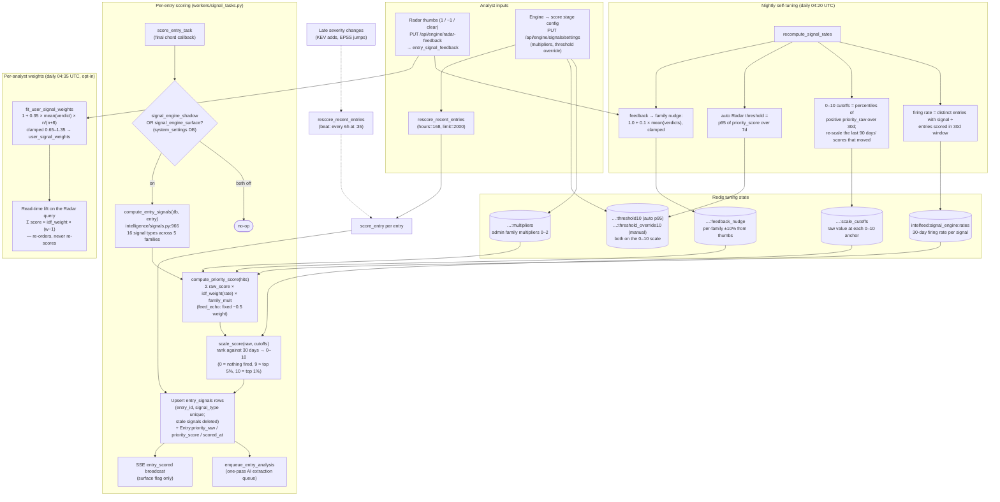

# Signal scoring feedback loop — per-entry scoring, nightly self-tuning, analyst feedback

```mermaid
flowchart TD
    subgraph SCORE["Per-entry scoring (workers/signal_tasks.py)"]
        TASK["score_entry_task<br/>(final chord callback)"] --> GATE{"signal_engine_shadow<br/>OR signal_engine_surface?<br/>(system_settings DB)"}
        GATE -- "both off" --> NOOP([no-op])
        GATE -- "on" --> COMPUTE["compute_entry_signals(db, entry)<br/>intelligence/signals.py:966<br/>16 signal types across 5 families"]
        COMPUTE --> WEIGH["compute_priority_score(hits)<br/>Σ raw_score × idf_weight(rate) × family_mult<br/>(feed_echo: fixed −0.5 weight)"]
        WEIGH --> SCALE["scale_score(raw, cutoffs)<br/>rank against 30 days → 0–10<br/>(0 = nothing fired, 9 ≈ top 5%, 10 = top 1%)"]
        SCALE --> PERSIST["Upsert entry_signals rows<br/>(entry_id, signal_type unique;<br/>stale signals deleted)<br/>+ Entry.priority_raw / priority_score / scored_at"]
        PERSIST --> AIQ["enqueue_entry_analysis<br/>(one-pass AI extraction queue)"]
        PERSIST --> SSE["SSE entry_scored broadcast<br/>(surface flag only)"]
    end

    subgraph REDIS["Redis tuning state"]
        RATES[("intelfeed:signal_engine:rates<br/>30-day firing rate per signal")]
        MULT[("…:multipliers<br/>admin family multipliers 0–2")]
        CUTS[("…:scale_cutoffs<br/>raw value at each 0–10 anchor")]
        THRESH[("…:threshold10 (auto p95)<br/>…:threshold_override10 (manual)<br/>both on the 0–10 scale")]
        NUDGE[("…:feedback_nudge<br/>per-family ±10% from thumbs")]
    end

    RATES --> WEIGH
    MULT --> WEIGH
    NUDGE --> WEIGH
    CUTS --> SCALE

    subgraph NIGHTLY["Nightly self-tuning (daily 04:20 UTC)"]
        RECOMPUTE["recompute_signal_rates"] --> R1["firing rate = distinct entries with signal ÷<br/>entries scored in 30d window"] --> RATES
        RECOMPUTE --> R4["0–10 cutoffs = percentiles of<br/>positive priority_raw over 30d;<br/>re-scale the last 90 days' scores that moved"] --> CUTS
        RECOMPUTE --> R2["auto Radar threshold =<br/>p95 of priority_score over 7d"] --> THRESH
        RECOMPUTE --> R3["feedback → family nudge:<br/>1.0 + 0.1 × mean(verdicts), clamped"] --> NUDGE
    end

    subgraph FEEDBACK["Analyst inputs"]
        THUMBS["Radar thumbs (1 / −1 / clear)<br/>PUT /api/engine/radar-feedback<br/>→ entry_signal_feedback"] --> R3
        ADMIN["Engine → score stage config<br/>PUT /api/engine/signals/settings<br/>(multipliers, threshold override)"] --> MULT
        ADMIN --> THRESH
        ADMIN --> RESCORE["rescore_recent_entries<br/>(hours=168, limit=2000)"]
    end

    subgraph PERSONAL["Per-analyst weights (daily 04:35 UTC, opt-in)"]
        FIT["fit_user_signal_weights<br/>1 + 0.35 × mean(verdict) × n/(n+8)<br/>clamped 0.65–1.35 → user_signal_weights"]
        FIT --> LIFT["Read-time lift on the Radar query<br/>Σ score × idf_weight × (w−1)<br/>— re-orders, never re-scores"]
    end

    THUMBS --> FIT

    RESCORE --> TASK2["score_entry per entry"] --> PERSIST
    KEV["Late severity changes<br/>(KEV adds, EPSS jumps)"] -.-> RESCORE6["rescore_recent_entries<br/>(beat: every 6h at :35)"] -.-> TASK2
```
