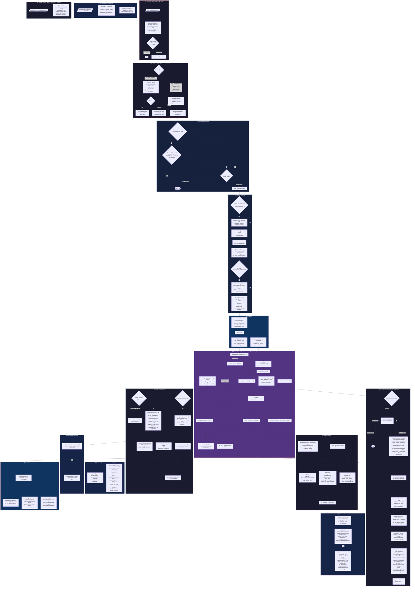

# Entry lifecycle — feed poll → fetch → persist → autolink/extract → correlate → score

```mermaid
flowchart TD
    subgraph POLLING["① Feed Polling (Celery Beat — every 60s)"]
        BEAT[/"celery-beat: poll_due_feeds"/]
        BEAT --> QUERY_FEEDS["Query feeds WHERE<br/>is_active=TRUE AND<br/>last_fetched + interval ≤ NOW<br/>ORDER BY last_fetched ASC NULLS FIRST<br/>LIMIT 50"]
        QUERY_FEEDS --> REDIS_LOCK{"Redis NX lock<br/>feed_fetch:{id}<br/>TTL 10min"}
        REDIS_LOCK -- "Already locked<br/>(in-flight)" --> SKIP([Skip])
        REDIS_LOCK -- "Lock acquired" --> DISPATCH["fetch_feed.delay(feed_id)"]
    end

    subgraph FETCH["② Feed Fetch (Celery Worker, max_retries=3)"]
        DISPATCH --> FEED_TYPE{"feed.feed_type?"}
        FEED_TYPE -- "rss / atom / youtube / podcast" --> HTTP_FETCH["HTTP GET feed.url<br/>If-None-Match: etag<br/>If-Modified-Since: last_modified<br/>timeout=30s<br/>(YouTube: 2 extra retries on 404/5xx)"]
        FEED_TYPE -- "reddit / github_releases /<br/>github_advisories / github_repo /<br/>nvd / mastodon / web_scraper /<br/>bluesky / telegram" --> EXTENDED["Extended adapter<br/>API-based fetch<br/>(Telegram: MTProto persistent listener)"]

        HTTP_FETCH --> HTTP_STATUS{"HTTP Status"}
        HTTP_STATUS -- "304" --> NOT_MODIFIED["Record not_modified<br/>update last_fetched_at<br/>return early"]
        HTTP_STATUS -- "4xx/5xx" --> ERROR_HANDLE["Increment error_count<br/>Log last_error<br/>Create feed error event"]
        HTTP_STATUS -- "200 OK" --> PARSE["adapter.parse_entries()<br/>→ feed_meta + ParsedEntry[]"]
        EXTENDED --> PARSE
    end

    subgraph DEDUP["③ De-duplication & Filtering"]
        PARSE --> GUID_CHECK{"GUID exists for feed?<br/>(+ intra-batch seen_guids set)"}
        GUID_CHECK -- "Yes" --> SKIP_ENTRY([Skip entry])
        GUID_CHECK -- "No" --> HASH_CHECK{"Cross-feed duplicate?<br/>content_hash =<br/>SHA-256(normalized title +<br/>first 500 chars)"}
        HASH_CHECK -- "Yes" --> SKIP_ENTRY
        HASH_CHECK -- "No" --> SHORTS{"YouTube feed with<br/>exclude_shorts?"}
        SHORTS -- "Yes → is Short" --> SKIP_ENTRY
        SHORTS -- "No / not Short" --> CONTENT_PROC
    end

    subgraph CONTENT["④ Content Processing"]
        CONTENT_PROC["Begin content processing"]
        CONTENT_PROC --> FULLTEXT{"content_text < 500 chars<br/>OR truncation marker<br/>('Continue reading on …')?"}
        FULLTEXT -- "Yes" --> EXTRACT_FULL["Fetch full article from entry URL<br/>(readability extraction)<br/>+ extract og:image"]
        FULLTEXT -- "No" --> SANITIZE
        EXTRACT_FULL --> SANITIZE["sanitize_html() — nh3 allowlist<br/>strips scripts, iframes,<br/>dangerous attrs"]
        SANITIZE --> METRICS["Compute word_count<br/>SHA-256 content_hash"]
        METRICS --> IMAGE["Extract lead image<br/>1. content_html img<br/>2. summary img<br/>3. fetched og:image<br/>4. _fetch_og_image fallback"]
        IMAGE --> MEDIA{"Has media?<br/>(podcast/YouTube/Telegram)"}
        MEDIA -- "Yes" --> MEDIA_PROC["Create EntryMedia<br/>fetch_youtube_transcript() /<br/>transcript_url → append to content<br/>Telegram: synchronous OCR if enabled"]
        MEDIA -- "No" --> CREATE_ENTRY
        MEDIA_PROC --> CREATE_ENTRY
    end

    subgraph PERSIST["⑤ Persistence"]
        CREATE_ENTRY["Create Entry record<br/>feed_id, guid, url, title, author,<br/>content_html, content_text, summary,<br/>image_url, word_count, content_hash,<br/>published_at, language, metadata_"]
        CREATE_ENTRY --> MEILI["Index in Meilisearch<br/>title, content_text, summary, author,<br/>published_at, feed_type, feed_title,<br/>language, word_count"]
        MEILI --> COMMIT["db.commit()"]
        COMMIT --> SSE["Publish one coalesced SSE event<br/>feed_fetched<br/>(feed_id, new_entries, entry_ids)"]
        COMMIT --> UPDATE_FEED["Update feed:<br/>last_fetched_at, etag, last_modified,<br/>error_count=0, backfill title/site_url"]
    end

    SSE --> TASK_FAN
    UPDATE_FEED --> TASK_FAN

    subgraph TASKFAN["⑥ Pipeline Dispatch (Celery chord — pipeline/registry.py)"]
        TASK_FAN["dispatch_entry_pipeline(entry_id)"]
        TASK_FAN --> TRANSLATE["Prologue: translate_entry_task<br/>(only if feed.auto_translate)"]
        TRANSLATE --> CHORD_GROUP["Prereq group (parallel)"]
        CHORD_GROUP --> AUTO_TASK["autolink_entry_task(eid)"]
        CHORD_GROUP --> OBS_TASK["observables_entry_task(eid)<br/>stage candidates + sight known values<br/>(regex never creates a ledger row)"]
        CHORD_GROUP --> TG_LINKS["scan_telegram_links_task(eid)"]
        CHORD_GROUP --> EXTRACT_TASK["extract_entry_intel_task(eid)<br/>(only if feed.auto_extract_on_ingest<br/>or feed.extract_detection_rules)"]

        AUTO_TASK --> POST["Callback: entry_post_processing(eid)"]
        OBS_TASK --> POST
        TG_LINKS --> POST
        EXTRACT_TASK --> POST

        POST --> COOCCUR_TASK["create_cooccurrence_relationships_task(eid)"]
        POST --> CORR_TASK["detect_correlation_events(eid)"]
        POST --> REQ_TASK["match_requirements_task(eid)"]
        COOCCUR_TASK --> SCORE_TASK["Final callback: score_entry_task(eid)<br/>signal engine"]
        CORR_TASK --> SCORE_TASK
        REQ_TASK --> SCORE_TASK

        TASK_FAN -.->|"dispatched directly,<br/>not part of chord"| RULE_TASK["run_entry_automations(eid, fid)"]
        TASK_FAN -.->|"per-feed batch"| KEYWORD_TASK["_check_keyword_alerts(eid)"]
    end

    subgraph AUTOLINK["⑦ Autolinking (Aho-Corasick Entity Recognition)"]
        AUTO_TASK --> EXTRACT_MODE{"feed.intel_extraction_mode?"}
        EXTRACT_MODE -- "none / manual" --> AUTOLINK_SKIP([Skip])
        EXTRACT_MODE -- "selective" --> RELEVANCE["score_relevance()<br/>fuzzy keyword match<br/>vs. security terms"]
        RELEVANCE -- "Below threshold" --> AUTOLINK_SKIP
        RELEVANCE -- "Above threshold" --> VOCAB
        EXTRACT_MODE -- "full" --> VOCAB

        VOCAB["Load Aho-Corasick vocabulary<br/>(Redis-versioned singleton:<br/>intelfeed:autolinker:vocab_version)<br/>actors, malware, countries + aliases;<br/>vendors, products, tools, mitigations<br/>FP filtering: min name length ·<br/>false-positive names CSV ·<br/>is_junk_alias() · LOLBin/binary filter<br/>(.exe/.dll/.sys)"]

        VOCAB --> SPLIT["split_into_paragraphs()<br/>title, summary, paragraphs"]
        SPLIT --> AC_SCAN["Phase 1: Aho-Corasick scan<br/>word-boundary check +<br/>ambiguity filter (short names<br/>must be capitalized)"]
        AC_SCAN --> REGEX_SCAN["Phase 2: Regex scan<br/>CVE-YYYY-NNNN<br/>TNNNN(.NNN) — validated against<br/>MITRE catalog, revoked IDs remapped"]
        REGEX_SCAN --> CONFIDENCE_W["Confidence scoring:<br/>canonical → high, alias → medium<br/>downgraded by feed<br/>reliability_rating weight"]
        CONFIDENCE_W --> STORE_LINKS["Store junction records<br/>EntryThreatActor / EntryMalware /<br/>EntryCountry / EntryCVE / EntryTTP /<br/>EntryVendor / EntryProduct /<br/>EntryTool / EntryMitigation<br/>ON CONFLICT DO NOTHING —<br/>provisional dictionary-word matches<br/>held in pending_autolink_matches<br/>(promoted/rejected by AI reconcile)"]
        STORE_LINKS --> UPDATE_STATS["Update entity stats<br/>article_count++<br/>last_seen_at = now"]
    end

    subgraph EXTRACTION["⑧ Intelligence Extraction"]
        EXTRACT_TASK --> GH_CHECK{"GitHub entry with<br/>content_type metadata?"}
        GH_CHECK -- "Yes (sigma_rule, etc.)" --> GH_IMPORT["process_github_entry()<br/>Direct rule import"]
        GH_CHECK -- "No" --> AI_PASS

        AI_PASS["Regex-only pass (no AI call here):<br/>MITRE technique IDs · CVE IDs ·<br/>mitigation M-IDs, over original +<br/>translated text. The one-pass AI<br/>analysis is enqueued by the score<br/>stage and runs on the batch queue."]
        AI_PASS --> TTP_STORE["Store TTPs (technique_id unique)<br/>new TTP → auto_enrich_entity.delay()"]
        AI_PASS --> CVE_STORE["Store CVEs (cve_id unique)<br/>new CVE → NVD API 2.0 fetch:<br/>CVSS, severity, description,<br/>CPEs, references"]

        EXTRACT_TASK --> RULE_EXTRACT{"feed.extract_detection_rules?"}
        RULE_EXTRACT -- "Yes" --> RULE_PARSE["extract_rules_from_content()<br/>Detects: Sigma (YAML) ·<br/>Elastic TOML (→ elastic_ql / kql) ·<br/>YARA · Snort/Suricata · Splunk SPL"]
        RULE_PARSE --> RULE_STORE["store_extracted_rules()<br/>→ DetectionRule + version v1"]

        TTP_STORE --> SYNC_IDX["sync_entity_search_indexes<br/>(if any extracted)"]
        CVE_STORE --> SYNC_IDX
    end

    subgraph ENRICHMENT["⑨ Enrichment (auto + Celery Beat schedules)"]
        ENRICH_PIPE["enrich_entity(trigger=auto)<br/>for new entities →<br/>EnrichmentSource adapters:<br/>NVD, OSV, CVEDetails, Wikipedia, …"]
        SCHEDULED["Beat-scheduled syncs:<br/>sync-kev-feed — every 6h<br/>cve-nvd-refresh — daily 12:00 UTC<br/>cve-nvd-backfill — daily 01:30 UTC<br/>epss-bulk-sync — daily 06:30 UTC<br/>github-poc-scan — daily 05:00 UTC<br/>cybergeist sync — daily 02:30 UTC<br/>mitre-attack-sync — weekly Sun 03:00<br/>malpedia-sync — weekly Sun 03:30<br/>wikipedia-bulk-sync — weekly Wed 04:00"]
    end

    TTP_STORE -.-> ENRICH_PIPE
    CVE_STORE -.-> ENRICH_PIPE

    subgraph CORRELATION["⑩ Correlation Engine"]
        COOCCUR_TASK --> COOCCUR["create_cooccurrence_relationships()<br/>per entity pair in entry:<br/>upsert EntityRelationship<br/>(typed verb, source=co_occurrence,<br/>confidence, append evidence_entry_ids)"]

        CORR_TASK --> CORR_DETECT["detect_correlation_events()<br/>run all event emitters"]
        CORR_DETECT --> EV_HIGH["🔴 HIGH<br/>coverage_gap · kev_addition ·<br/>exploit_status_change ·<br/>cve_score_change ·<br/>new_exploit_discovered"]
        CORR_DETECT --> EV_MED["🟡 MEDIUM<br/>trending_entity · campaign_match ·<br/>requirement_match · feed_error ·<br/>new_ttp_for_known_actor ·<br/>new_ttp_for_known_malware ·<br/>new_malware_for_known_actor"]
        CORR_DETECT --> EV_LOW["🟢 LOW<br/>feed_stale ·<br/>actor_malware_cooccurrence ·<br/>new_intel_for_rule"]

        EV_HIGH --> CORR_AUTO["run_correlation_automations()"]
        EV_MED --> CORR_AUTO
        EV_LOW --> CORR_AUTO
    end

    subgraph AUTOMATION["⑪ Automation Engine"]
        RULE_TASK --> AUTO_ENGINE["Triggers: on_new_entry ·<br/>on_keyword_match · on_cve_detected ·<br/>on_correlation_event · on_schedule"]
        AUTO_ENGINE --> EVAL_CONDITIONS["Conditions: feed/feed_type/author/tag<br/>matches · content_contains ·<br/>severity_above · priority_score_above ·<br/>has_signal · entity_watchlisted ·<br/>read/starred/bookmarked/note state"]
        EVAL_CONDITIONS -- "Match" --> ACTIONS["Actions: run_ai_task · add/remove tags ·<br/>send_notification (Slack + in-app) ·<br/>run_webhook · mark/star/bookmark/hide ·<br/>create_note · extract_* · generate rules ·<br/>add_to_campaign · create_intel_report ·<br/>branch (conditional sub-chains)"]
        CORR_AUTO --> AUTO_ENGINE
    end

    subgraph REQUIREMENTS["⑫ Intelligence Requirements"]
        REQ_TASK --> REQ_MATCH["match_entry_against_requirements()<br/>required entities · keyword filters ·<br/>custom criteria"]
        REQ_MATCH -- "Match" --> REQ_RECORD["Create RequirementMatch<br/>→ requirement_match event"]
    end

    subgraph SIGNAL["⑬ Signal Scoring & Triage"]
        SCORE_TASK --> SIG_SCORE["Signal engine writes<br/>Entry.priority_score + entry_signals"]
        SIG_SCORE --> ENQ["enqueue_entry_analysis()<br/>→ one-pass AI batch queue<br/>(ai_one_pass_enabled + budget)"]
        SIG_SCORE --> TRIAGE["Triage queue (services/triage.py)<br/>legacy composite, or the stored<br/>priority_score when the signal<br/>engine is surfaced"]
        SIG_SCORE --> PQ["Priority Queue<br/>GET /entries/priority-queue —<br/>radar-ranked unread with open<br/>story threads folded in as rows"]
    end

    subgraph DAILY["⑭ Daily Summaries (Celery Beat)"]
        DS_BEAT[/"generate_daily_summaries<br/>daily 06:00 UTC"/]
        DS_BEAT --> DS_GEN["One shared AI summary per day<br/>(GLOBAL_SUMMARY_USER sentinel,<br/>idempotent) with inline entity links"]
        DS_GEN --> DS_UI["Reader day dividers +<br/>daily summary panel<br/>(same content for all users)"]
    end

    subgraph TG_GRAPH["⑮ Telegram Forward Graph (Celery Beat — every 4h)"]
        TG_BEAT[/"build_telegram_forward_relationships"/]
        TG_BEAT --> TG_REL["Scan entries' forwarded_from metadata<br/>→ upsert communicates_with<br/>EntityRelationship edges<br/>(source=auto_extracted,<br/>confidence=probable)"]
    end

    style POLLING fill:#1a1a2e,stroke:#e94560,color:#fff
    style FETCH fill:#1a1a2e,stroke:#e94560,color:#fff
    style DEDUP fill:#16213e,stroke:#0f3460,color:#fff
    style CONTENT fill:#16213e,stroke:#0f3460,color:#fff
    style PERSIST fill:#0f3460,stroke:#533483,color:#fff
    style TASKFAN fill:#533483,stroke:#e94560,color:#fff
    style AUTOLINK fill:#1b1b2f,stroke:#1f4068,color:#fff
    style EXTRACTION fill:#1b1b2f,stroke:#1f4068,color:#fff
    style ENRICHMENT fill:#162447,stroke:#1f4068,color:#fff
    style CORRELATION fill:#1a1a2e,stroke:#e94560,color:#fff
    style AUTOMATION fill:#162447,stroke:#533483,color:#fff
    style REQUIREMENTS fill:#162447,stroke:#533483,color:#fff
    style SIGNAL fill:#0f3460,stroke:#e94560,color:#fff
    style DAILY fill:#162447,stroke:#0f3460,color:#fff
    style TG_GRAPH fill:#1a1a2e,stroke:#0f3460,color:#fff
```
